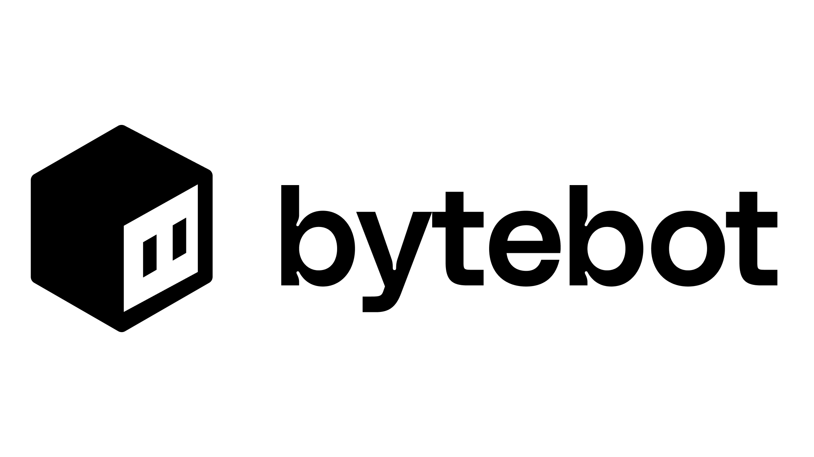

<div align="center">



# Bytebot: 开源AI桌面智能体

<a href="https://trendshift.io/repositories/14624" target="_blank"></a>

**一个拥有自己电脑的AI，为您完成各种任务**

[](https://railway.com/deploy/bytebot?referralCode=L9lKXQ)

[](https://github.com/bytebot-ai/bytebot/tree/main/docker)
[](LICENSE)
[](https://discord.com/invite/d9ewZkWPTP)

[🌐 官网](https://bytebot.ai) • [📚 文档](https://docs.bytebot.ai) • [💬 Discord](https://discord.com/invite/d9ewZkWPTP) • [𝕏 Twitter](https://x.com/bytebot_ai)

<!-- Keep these links. Translations will automatically update with the README. -->
[Deutsch](https://zdoc.app/de/bytebot-ai/bytebot) | 
[Español](https://zdoc.app/es/bytebot-ai/bytebot) | 
[français](https://zdoc.app/fr/bytebot-ai/bytebot) | 
[日本語](https://zdoc.app/ja/bytebot-ai/bytebot) | 
[한국어](https://zdoc.app/ko/bytebot-ai/bytebot) | 
[Português](https://zdoc.app/pt/bytebot-ai/bytebot) | 
[Русский](https://zdoc.app/ru/bytebot-ai/bytebot) | 
[中文](https://zdoc.app/zh/bytebot-ai/bytebot)
</div>

---

https://github.com/user-attachments/assets/f271282a-27a3-43f3-9b99-b34007fdd169

https://github.com/user-attachments/assets/72a43cf2-bd87-44c5-a582-e7cbe176f37f

## 什么是桌面智能体？

桌面智能体是一个拥有自己电脑的AI。与仅限浏览器的智能体或传统RPA工具不同，Bytebot配备了完整的虚拟桌面，可以：

- 使用任何应用程序（浏览器、邮件客户端、办公工具、IDE）
- 使用自己的文件系统下载和整理文件
- 使用密码管理器登录网站和应用程序
- 读取和处理文档、PDF和电子表格
- 跨不同程序完成复杂的多步骤工作流程

可以将其视为拥有自己电脑的虚拟员工，能够看到屏幕、移动鼠标、在键盘上打字，并像人类一样完成任务。

## 为什么要给AI一台自己的电脑？

当AI能够访问完整的桌面环境时，它解锁了仅限浏览器的智能体或API集成无法实现的功能：

### 完全任务自主性

给Bytebot一个任务，比如"从我们的供应商门户下载所有发票并将它们整理到一个文件夹中"，它将：

- 打开浏览器
- 导航到每个门户
- 处理身份验证（包括通过密码管理器进行2FA）
- 将文件下载到本地文件系统
- 将它们整理到文件夹中

### 处理文档

直接将文件上传到Bytebot的桌面，它可以：

- 将整个PDF读入其上下文
- 从复杂文档中提取数据
- 跨多个文件交叉引用信息
- 基于分析创建新文档
- 处理API无法访问的格式

### 使用真实应用程序

Bytebot不仅限于Web界面。它可以：

- 使用桌面应用程序，如文本编辑器、VS Code或邮件客户端
- 运行脚本和命令行工具
- 根据需要安装新软件
- 为特定工作流程配置应用程序

## 快速开始

### 2分钟内部署

**选项1：Railway（最简单）**
[](https://railway.com/deploy/bytebot?referralCode=L9lKXQ)

只需点击并添加您的AI提供商API密钥。

**选项2：Docker Compose**

```bash
git clone https://github.com/bytebot-ai/bytebot.git
cd bytebot

# 添加您的AI提供商密钥（选择一个）
echo "ANTHROPIC_API_KEY=sk-ant-..." > docker/.env
# 或者：echo "OPENAI_API_KEY=sk-..." > docker/.env
# 或者：echo "GEMINI_API_KEY=..." > docker/.env

docker-compose -f docker/docker-compose.yml up -d

# 打开 http://localhost:9992
```

[完整部署指南 →](https://docs.bytebot.ai/quickstart)

## 工作原理

Bytebot由四个集成组件组成：

1. **虚拟桌面**：预装应用程序的完整Ubuntu Linux环境
2. **AI智能体**：理解您的任务并控制桌面来完成它们
3. **任务界面**：创建任务和观看Bytebot工作的Web UI
4. **API**：用于程序化任务创建和桌面控制的REST端点

### 主要功能

- **自然语言任务**：用简单的英语描述您想要完成的任务
- **文件上传**：将文档直接拖放到Bytebot的桌面
- **实时桌面视图**：观看AI实时工作
- **多AI提供商**：选择Anthropic Claude、OpenAI GPT或Google Gemini
- **安全隔离**：每个任务在隔离的容器中运行
- **API访问**：通过REST API集成到您的工作流程中

## 示例任务

### 基础示例

```
"去维基百科创建量子计算的摘要"
"研究从纽约到伦敦的航班并创建比较文档"
"截取前5个新闻网站的屏幕截图"
```

### 文档处理

```
"阅读上传的contracts.pdf并提取所有付款条款和截止日期"
"处理这5个发票PDF并创建摘要报告"
"下载并分析最新的财务报告并回答：提到的主要风险是什么？"
```

### 多应用程序工作流程

```
"从我们的三家银行下载上个月的银行对账单并合并它们"
"检查我们所有的供应商门户网站以获取新发票并创建摘要报告"
"登录我们的CRM，导出客户列表，并更新ERP系统中的记录"
```

## 程序化控制

### 通过API创建任务

```python
import requests

# 创建新任务
response = requests.post('http://localhost:9992/api/tasks', json={
    'instruction': '从这个网站下载价格表并保存为PDF',
    'url': 'https://example.com/pricing'
})

task_id = response.json()['task_id']

# 检查任务状态
status = requests.get(f'http://localhost:9992/api/tasks/{task_id}')
print(status.json())
```

### 直接桌面控制

```python
import requests

# 截屏
screenshot = requests.get('http://localhost:9992/api/desktop/screenshot')

# 点击坐标
requests.post('http://localhost:9992/api/desktop/click', json={
    'x': 100, 'y': 200
})

# 输入文本
requests.post('http://localhost:9992/api/desktop/type', json={
    'text': 'Hello World'
})
```

[Full API documentation →](https://docs.bytebot.ai/api-reference/introduction)

## 设置桌面智能体

### 1. 部署Bytebot

使用上述部署方法之一来运行Bytebot。

### 2. 配置桌面

在UI中使用桌面选项卡：

- 安装您需要的其他程序
- 设置密码管理器进行身份验证
- 根据您的偏好配置应用程序
- 登录您希望Bytebot访问的网站

### 3. 开始分配任务

用自然语言创建任务，观看Bytebot使用配置的桌面完成它们。

## 使用场景

### 业务流程自动化

- **发票处理**：从供应商门户下载发票，提取数据，更新会计系统
- **报告生成**：从多个来源收集数据，创建格式化报告
- **数据录入**：将信息从文档转移到数据库或电子表格
- **合规检查**：审查文档的合规性并生成审计报告

### 开发与测试

- **网站测试**：自动化用户界面测试和回归测试
- **数据迁移**：在系统之间移动和转换数据
- **环境设置**：配置开发环境和部署应用程序
- **代码审查**：分析代码库并生成文档

### 研究与分析

- **市场研究**：从多个来源收集竞争对手信息
- **内容创建**：研究主题并创建综合报告
- **数据分析**：处理数据集并创建可视化
- **监控**：跟踪网站变化和价格更新

## 架构

### 桌面
- **操作系统**：Ubuntu 22.04 LTS
- **桌面环境**：XFCE（轻量级且稳定）
- **预装应用**：Firefox、文本编辑器、文件管理器、终端
- **访问方式**：通过VNC进行实时查看和控制

### AI智能体
- **视觉**：使用屏幕截图进行视觉理解
- **控制**：通过模拟鼠标点击和键盘输入进行桌面控制
- **提供商**：支持Anthropic Claude、OpenAI GPT-4、Google Gemini
- **推理**：将复杂任务分解为可执行步骤

### UI
- **任务管理**：基于Web的界面，用于创建和监控任务
- **桌面查看器**：实时VNC查看器，可观看AI工作
- **文件管理**：拖放文件上传和下载
- **控制**：接管模式，用于手动干预

### AI支持
- **多模态**：处理文本、图像和文档
- **上下文感知**：理解屏幕内容和应用程序状态
- **错误处理**：从失败中恢复并重试操作
- **学习**：从交互中改进性能

### 部署
- **容器化**：完全Docker化，便于部署
- **可扩展**：支持多个并发桌面实例
- **云就绪**：可在任何支持Docker的平台上运行
- **安全**：隔离环境，具有网络和文件系统控制

## 为什么选择自托管？

### 数据控制
- **隐私**：您的数据永远不会离开您的基础设施
- **合规**：满足GDPR、HIPAA和其他法规要求
- **安全**：完全控制访问和权限
- **审计**：完整的操作和数据访问日志

### 成本效益
- **无使用限制**：运行无限任务，无需按使用付费
- **可预测成本**：仅支付基础设施费用
- **资源优化**：根据您的需求调整资源
- **长期节省**：避免基于使用量的定价模式

### 定制化
- **环境控制**：安装任何您需要的软件
- **集成**：与您现有的系统和工作流程集成
- **配置**：根据您的特定需求定制设置
- **扩展**：添加自定义功能和集成

## 高级功能

### 多AI提供商

通过我们的[LiteLLM集成](https://docs.bytebot.ai/deployment/litellm)使用任何AI提供商：

- Azure OpenAI
- AWS Bedrock
- 通过Ollama的本地模型
- 100多个其他提供商

### 企业部署

使用Helm在Kubernetes上部署：

```bash
# 克隆仓库
git clone https://github.com/bytebot-ai/bytebot.git
cd bytebot

# 使用Helm安装
helm install bytebot ./helm \
  --set agent.env.ANTHROPIC_API_KEY=sk-ant-...
```

[企业部署指南 →](https://docs.bytebot.ai/deployment/helm)

## 社区与支持

- **Discord**：[加入我们的社区](https://discord.com/invite/d9ewZkWPTP)获取帮助和讨论
- **文档**：在[docs.bytebot.ai](https://docs.bytebot.ai)查看综合指南
- **GitHub Issues**：报告错误和请求功能

## 贡献

我们欢迎贡献！无论是：

- 🐛 错误修复
- ✨ 新功能
- 📚 文档改进
- 🌐 翻译

请：

1. 首先检查现有的[issues](https://github.com/bytebot-ai/bytebot/issues)
2. 开启issue讨论重大更改
3. 提交带有清晰描述的PR
4. 加入我们的[Discord](https://discord.com/invite/d9ewZkWPTP)讨论想法

## 🆕 项目结构升级

ByteBot 项目已完成全面的结构重组和功能升级！主要改进包括：

### ✨ 新功能特性
- **🧠 系统提示词支持**: 动态加载和管理系统提示词，支持版本控制和模板化
- **📚 用户历史记录**: 完整的对话历史存储和检索功能，支持会话管理和智能搜索  
- **🔧 MCP 协议支持**: 集成 Model Context Protocol 工具调用能力，支持多服务器和工具链

### 📁 目录结构优化
- **统一命名规范**: 采用 kebab-case 命名约定，提升代码一致性
- **模块化组织**: 按功能模块重新组织代码结构，便于维护和扩展
- **配置集中管理**: 所有配置文件统一在 `config/` 目录，支持环境隔离

### 🚀 性能提升
- **Node.js 20**: 升级到 Node.js 20 LTS，获得最佳性能和稳定性
- **优化架构**: 核心模块重构，提升响应速度和资源利用率

详细信息请查看 [新项目结构说明](./docs/project/NEW_PROJECT_STRUCTURE.md)

## 许可证

Bytebot是Apache 2.0许可证下的开源项目。

---

<div align="center">

**给您的AI一台自己的电脑。看看它能做什么。**

[](https://railway.com/deploy/bytebot?referralCode=L9lKXQ)

<sub>由[Tantl Labs](https://tantl.com)和开源社区构建</sub>

</div>
