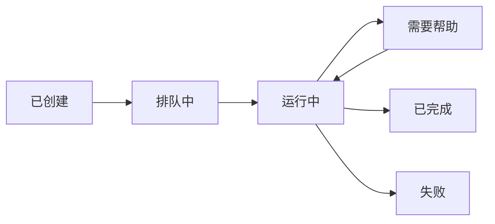

## 概述

Bytebot智能体系统将简单的桌面容器转变为智能、自主的计算机用户。通过将Claude AI与结构化任务管理相结合，它可以理解自然语言请求并像人类一样执行复杂的工作流程。


## AI智能体的工作原理

### 大脑：多模型AI集成

Bytebot的核心是支持多种模型的灵活AI集成。选择最适合您需求的AI：

**Anthropic Claude**（默认）：
- 最适合复杂推理和视觉理解
- 擅长遵循详细指令
- 在桌面自动化任务上表现卓越

**OpenAI GPT模型**：
- 快速可靠的通用自动化
- 强大的代码理解和生成能力
- 日常任务的成本效益高

**Google Gemini**：
- 高容量任务的高效处理
- 速度和能力的良好平衡
- 出色的多语言支持

智能体与任何模型：

1. **理解上下文**：处理您的自然语言请求，包含完整对话历史
2. **规划操作**：将复杂任务分解为可执行的计算机操作
3. **实时适应**：根据屏幕上看到的内容调整方法
4. **从反馈中学习**：通过对话改进任务执行

### 对话流程

<Steps>
  <Step title="您描述任务">
    "研究我的SaaS产品的竞争对手并创建对比表"
  </Step>
  <Step title="AI规划方法">
    AI模型理解请求并规划：打开浏览器 → 搜索 → 访问网站 → 提取数据 → 创建文档
  </Step>
  <Step title="执行操作">
    智能体控制桌面：点击、输入、截图、阅读内容
  </Step>
  <Step title="提供更新">
    实时状态更新，需要时请求澄清
  </Step>
  <Step title="交付结果">
    完成任务并提供输出（文件、截图、摘要）
  </Step>
</Steps>

## 任务管理系统

### 任务生命周期

任务通过结构化生命周期流转：



### 任务属性

每个任务包含：

- **描述**：需要完成的工作
- **优先级**：紧急、高、中或低
- **状态**：生命周期中的当前状态
- **类型**：立即或计划
- **历史**：所有消息和已采取的操作

### 智能任务处理

智能体智能处理任务：

1. **优先级队列**：紧急任务优先运行
2. **错误恢复**：自动重试失败的操作
3. **人机协作**：遇到困难时寻求帮助
4. **上下文保持**：跨会话维护对话历史

## 真实世界能力

### What the Agent Can Do

<CardGroup cols={2}>
  <Card title="Web Automation" icon="globe">
    - Browse websites
    - Fill out forms
    - Extract data
    - Download files
    - Monitor changes
  </Card>
  <Card title="Document Work" icon="file">
    - Create documents
    - Edit spreadsheets
    - Generate reports
    - Organize files
    - Convert formats
  </Card>
  <Card title="Email & Communication" icon="envelope">
    - Access webmail through browser
    - Read and extract information
    - Fill contact forms
    - Navigate communication portals
    - Handle verification flows
  </Card>
  <Card title="Data Processing" icon="database">
    - Extract from PDFs
    - Process CSV files
    - Create visualizations
    - Generate summaries
    - Transform data
  </Card>
</CardGroup>

## Technical Architecture

### Core Components

1. **NestJS Agent Service**
   - Integrates with multiple AI provider APIs (Anthropic, OpenAI, Google)
   - Handles WebSocket connections
   - Coordinates with desktop API

2. **Message System**
   - Structured conversation format
   - Supports text and images
   - Maintains full context
   - Enables rich interactions

3. **Database Schema**
   ```sql
   Tasks: id, description, status, priority, timestamps
   Messages: id, task_id, role, content, timestamps
   Summaries: id, task_id, content, parent_id
   ```

4. **Computer Action Bridge**
   - Translates AI decisions to desktop actions
   - Handles screenshots and feedback
   - Manages action timing
   - Provides error handling

### API Endpoints

Key endpoints for programmatic control:

```typescript
// Create a new task
POST /tasks
{
  "description": "Your task description",
  "priority": "HIGH",
  "type": "IMMEDIATE"
}

// Get task status
GET /tasks/:id

// Send a message
POST /tasks/:id/messages
{
  "content": "Additional instructions"
}

// Get task history
GET /tasks/:id/messages
```

## Chat UI Features

The web interface provides:

### Real-time Interaction
- Live chat with the AI agent
- Instant status updates
- Progress indicators
- Error notifications

### Visual Feedback
- Embedded desktop viewer
- Screenshot history
- Action replay
- Task timeline

### Task Management
- Create and prioritize tasks
- View active and completed tasks
- Export conversation logs
- Manage task queues

## Security & Privacy

### Data Isolation
- All processing happens in your infrastructure
- No data sent to external services (except your chosen AI provider API)
- Conversations stored locally
- Complete audit trail

### Access Control
- Configurable authentication
- API key management
- Network isolation options

## Extending the Agent

### Integration Points
- External API calls via the Agent API
- Custom AI prompts for specialized workflows
- MCP protocol support for tool integration


### Best Practices

1. **Clear Instructions**: Be specific about desired outcomes
2. **Break Down Complex Tasks**: Use multiple smaller tasks for better results
3. **Provide Context**: Include relevant files or URLs
4. **Monitor Progress**: Watch the desktop view for real-time feedback
5. **Review Results**: Verify outputs meet requirements

## Troubleshooting

<AccordionGroup>
  <Accordion title="Agent not responding">
    - Check your AI provider API key is valid
    - Verify agent service is running
    - Review logs for errors
    - Ensure sufficient API credits/quota with your provider
  </Accordion>
  
  <Accordion title="Slow task execution">
    - Monitor system resources
    - Check network latency
    - Reduce screenshot frequency
    - Optimize AI prompts for your chosen model
    - Consider switching to a faster model (e.g., Gemini Flash)
  </Accordion>
</AccordionGroup>

## Next Steps

<CardGroup cols={2}>
  <Card title="Quick Start" icon="rocket" href="/quickstart">
    Get your agent running
  </Card>
  <Card title="API Reference" icon="code" href="/api-reference/agent/tasks">
    Integrate with your apps
  </Card>
  <Card title="Use Cases" icon="lightbulb" href="#example-use-cases">
    See what's possible
  </Card>
  <Card title="Best Practices" icon="star" href="#best-practices">
    Optimize your workflows
  </Card>
</CardGroup>