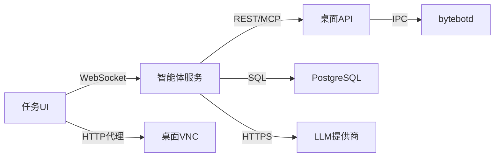

## 概述

Bytebot是一个自托管的AI桌面智能体，采用模块化架构构建。它将Linux桌面环境与AI相结合，创建了一个能够通过自然语言指令执行任务的自主计算机用户。


## 系统架构

系统由四个协同工作的主要组件组成：

### 1. Bytebot桌面容器
系统的基础——提供虚拟Linux桌面：

- **Ubuntu 22.04 LTS**基础，确保稳定性和兼容性
- **XFCE4桌面**，轻量级、响应迅速的UI
- **bytebotd守护进程**——基于nutjs构建的自动化服务，执行计算机操作
- **预装应用程序**：Firefox ESR、Thunderbird、文本编辑器和开发工具
- **noVNC**用于远程桌面访问

**主要功能：**
- 与您的主机系统完全隔离运行
- 跨不同平台的一致环境
- 可以使用额外软件进行自定义
- 通过端口9990上的REST API访问
- MCP SSE端点在`/mcp`可用
- 使用来自`@bytebot/shared`包的共享类型

### 2. AI智能体服务
系统的大脑——使用LLM编排任务：

- **NestJS框架**，用于构建强大、可扩展的后端
- **LLM集成**，支持Anthropic Claude、OpenAI GPT和Google Gemini模型
- **WebSocket支持**，用于实时更新
- **计算机使用API客户端**，用于控制桌面
- **Prisma ORM**，用于数据库操作
- **工具定义**，用于计算机操作（鼠标、键盘、截图）

**职责：**
- 解释自然语言请求
- 规划计算机操作序列
- 管理任务状态和进度
- 处理错误和重试
- 通过WebSocket提供实时任务更新

### 3. Web任务界面
与您的AI智能体交互的用户界面：

- **Next.js 15应用程序**，使用TypeScript确保类型安全
- **嵌入式VNC查看器**，观看桌面操作过程
- **任务管理**UI，带有状态标识
- **WebSocket连接**，用于实时更新
- **可重用组件**，确保UI一致性
- **API工具**，简化服务器通信

**功能：**
- 任务创建和管理界面
- 桌面标签页，用于直接手动控制
- 实时桌面查看器，支持接管模式
- 任务历史和状态跟踪
- 适配所有设备的响应式设计

### 4. PostgreSQL数据库
智能体系统的持久化存储：

- **任务表**：存储任务详情、状态和元数据
- **消息表**：存储AI对话历史
- **Prisma ORM**，用于类型安全的数据库访问

## 数据流

### 任务执行流程

<Steps>
  <Step title="用户输入">
    用户通过聊天UI用自然语言描述任务
  </Step>
  <Step title="任务创建">
    智能体服务创建任务记录并将其添加到处理队列
  </Step>
  <Step title="AI规划">
    LLM分析任务并生成计算机操作计划
  </Step>
  <Step title="操作执行">
    智能体通过REST API或MCP向bytebotd发送计算机操作
  </Step>
  <Step title="桌面自动化">
    bytebotd在桌面上执行操作（鼠标、键盘、截图）
  </Step>
  <Step title="结果处理">
    智能体接收结果，更新任务状态，并继续或完成任务
  </Step>
  <Step title="用户反馈">
    结果和状态更新实时发送回用户
  </Step>
</Steps>

### 通信协议



## 安全架构

### 隔离层

1. **容器隔离**
   - 每个桌面在自己的Docker容器中运行
   - 默认情况下无法访问主机文件系统
   - 通过显式端口映射进行网络隔离

2. **进程隔离**
   - bytebotd以非root用户身份运行
   - 不同服务使用独立进程
   - Docker强制执行资源限制

3. **网络安全**
   - 默认情况下服务仅可从localhost访问
   - 可配置身份验证
   - 外部连接使用HTTPS/WSS

### API安全

 - **桌面API**：默认无身份验证（仅localhost）。支持REST和MCP。
- **智能体API**：可使用API密钥进行保护
- **数据库**：密码保护，不对外暴露

<Warning>
  默认配置适用于开发环境。生产环境请：
  - 在所有API上启用身份验证
  - 对所有连接使用HTTPS/WSS
  - 实施网络策略
  - 定期轮换凭据
</Warning>

## 部署模式

### 单用户（开发）
```yaml
服务：所有服务在一台机器上
规模：每个服务1个实例
用例：个人自动化、开发
资源：4GB内存，2个CPU核心
```

### 生产部署
```yaml
服务：所有服务在专用硬件上
规模：单实例（1个智能体，1个桌面）
用例：业务自动化
资源：8GB+内存，4+个CPU核心
```

### 企业部署
```yaml
服务：Kubernetes编排
规模：高可用单实例
用例：组织级自动化
资源：专用节点
```

## 扩展点

### 自定义工具
向桌面添加专业软件：
```dockerfile
FROM bytebot/desktop:latest
RUN apt-get update && apt-get install -y \
    your-custom-tools
```

### AI集成
扩展智能体功能：
- LLM的自定义工具
- 额外的AI模型
- 专业化提示
- 领域特定知识

## 性能考虑

### 资源使用
- **桌面容器**：空闲时约1GB内存，活跃时2GB+
- **智能体服务**：约256MB内存
- **UI服务**：约128MB内存
- **数据库**：约256MB内存

### 优化建议
1. 为容器分配足够的资源
2. 限制并发任务以防止过载
3. 定期监控资源使用情况
4. 使用LiteLLM代理提供商灵活性

## 下一步

<CardGroup cols={2}>
  <Card title="智能体系统" icon="robot" href="/core-concepts/agent-system">
    了解AI智能体功能
  </Card>
  <Card title="桌面环境" icon="desktop" href="/core-concepts/desktop-environment">
    探索虚拟桌面环境
  </Card>
  <Card title="API参考" icon="code" href="/api-reference/introduction">
    与您的应用程序集成
  </Card>
  <Card title="部署指南" icon="rocket" href="/quickstart">
    部署您自己的实例
  </Card>
</CardGroup>