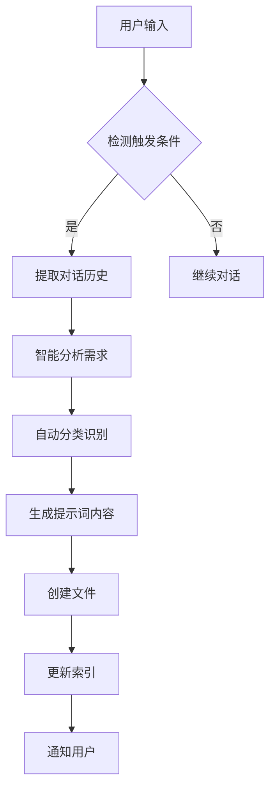

# 提示词库自动化管理工具

## 概述

本工具提供了完整的提示词库自动化管理解决方案，包括：
- 🤖 **自动创建**：基于用户确认自动生成提示词
- 📝 **智能分类**：自动识别业务、功能、技术分类
- 🔍 **快速检索**：多维度搜索和索引管理
- 📊 **统计分析**：使用频率和效果统计
- 🛠️ **CLI工具**：命令行管理界面

## 功能特性

### 🎯 自动化触发机制
- **智能检测**：识别用户确认关键词（"牛逼"、"确认"、"认可"等）
- **模式匹配**：支持正则表达式模式匹配
- **上下文分析**：基于对话历史智能判断
- **综合评分**：多维度条件综合判断触发

### 🧠 智能内容生成
- **需求提取**：从对话历史中智能提取需求信息
- **自动分类**：基于关键词自动识别分类
- **模板生成**：使用预定义模板生成标准化内容
- **质量评估**：自动评估生成内容质量

### 📁 完整文件管理
- **目录结构**：标准化的三维分类目录
- **文件命名**：统一的命名规范和ID管理
- **索引维护**：自动更新标签、关键词、统计索引
- **版本控制**：支持文件版本管理和备份

## 安装配置

### 环境要求
- Python 3.8+
- PyYAML
- Click

### 安装步骤

1. **安装依赖**
```bash
cd /Users/zhiledeng/Downloads/新闻模块api接口/bytebot/提示词库/automation
pip install -r requirements.txt
```

2. **创建requirements.txt**
```bash
echo "PyYAML>=6.0" > requirements.txt
echo "click>=8.0" >> requirements.txt
echo "pathlib" >> requirements.txt
```

3. **初始化目录结构**
```bash
python cli.py init
```

4. **验证安装**
```bash
python cli.py validate
```

## 使用指南

### 🚀 快速开始

#### 1. 手动创建提示词
```bash
python cli.py create \
  --title "需求分析" \
  --content "请帮我分析这个需求..." \
  --business "需求分析" \
  --function "方案生成" \
  --technical "AI_ML" \
  --tags "需求分析,用户故事" \
  --keywords "需求,分析,评估" \
  --scenarios "新功能开发,产品规划"
```

#### 2. 自动生成提示词
```bash
# 准备对话历史JSON文件
echo '["我需要一个用户管理系统", "包括注册登录功能", "这个方案很好，确认"]' > conversation.json

# 自动生成
python cli.py auto-generate --conversation conversation.json
```

#### 3. 搜索提示词
```bash
# 关键词搜索
python cli.py search --keyword "需求分析"

# 分类搜索
python cli.py search --category "项目管理"

# 标签搜索
python cli.py search --tag "沟通协作"
```

#### 4. 查看统计信息
```bash
# 显示统计信息
python cli.py stats

# 列出所有分类
python cli.py list-categories
```

### 🔧 高级功能

#### 自动化集成

在Python代码中集成自动化功能：

```python
from prompt_manager import PromptLibraryManager

# 初始化管理器
manager = PromptLibraryManager()

# 检测触发条件
user_input = "这个需求分析很好，我确认"
if manager.detect_trigger(user_input):
    print("检测到触发条件")

# 自动生成提示词
conversation = [
    "我需要开发一个电商系统",
    "包括商品管理、订单处理、支付功能", 
    "需要支持多种支付方式",
    "这个技术方案很好，我认可"
]

file_path = manager.auto_generate_prompt(conversation)
if file_path:
    print(f"自动生成提示词：{file_path}")
```

#### 配置自定义

修改 `config.yaml` 文件来自定义行为：

```yaml
# 自定义触发关键词
triggers:
  keywords:
    - "确认"
    - "同意" 
    - "采用"
    - "通过"

# 自定义分类规则
auto_classification:
  business_keywords:
    需求分析:
      - "需求"
      - "用户故事"
    方案设计:
      - "架构"
      - "设计"
```

## 工作流程

### 🔄 自动化流程



### 📋 手动管理流程

1. **创建提示词**
   - 使用CLI命令或Python API
   - 指定分类和元数据
   - 自动生成文件和索引

2. **搜索和查找**
   - 多维度搜索支持
   - 关键词、分类、标签筛选
   - 快速定位目标提示词

3. **维护和优化**
   - 定期验证文件完整性
   - 更新使用统计
   - 优化分类和标签

## 目录结构

```
提示词库/
├── automation/                 # 自动化工具
│   ├── prompt_manager.py      # 核心管理器
│   ├── cli.py                 # CLI工具
│   ├── config.yaml            # 配置文件
│   ├── requirements.txt       # 依赖列表
│   └── README.md             # 使用说明
├── 业务分类/                   # 业务维度分类
│   ├── 需求分析/
│   ├── 方案设计/
│   ├── 开发实现/
│   ├── 质量保证/
│   ├── 部署运维/
│   └── 项目管理/
├── 功能分类/                   # 功能维度分类
│   ├── 问题诊断/
│   ├── 方案生成/
│   ├── 代码操作/
│   ├── 工具使用/
│   └── 知识管理/
├── 技术分类/                   # 技术维度分类
│   ├── 前端技术/
│   ├── 后端技术/
│   ├── DevOps/
│   ├── AI_ML/
│   └── 安全技术/
└── 索引文件/                   # 索引和统计
    ├── 标签索引.md
    ├── 关键词索引.md
    └── 使用频率统计.md
```

## 配置说明

### 触发条件配置

```yaml
triggers:
  keywords:           # 关键词列表
    - "牛逼"
    - "确认"
    - "认可"
  
  patterns:           # 正则表达式模式
    - "确认.*需求"
    - "认可.*方案"
  
  context_conditions: # 上下文条件
    - "需求文档"
    - "用户故事"
```

### 分类规则配置

```yaml
auto_classification:
  business_keywords:
    需求分析:
      - "需求"
      - "用户故事"
    方案设计:
      - "架构"
      - "设计"
```

### 质量评估配置

```yaml
quality_assessment:
  scoring_rules:
    high_quality: 4.5
    medium_quality: 3.5
    low_quality: 2.5
```

## 最佳实践

### 🎯 提示词设计原则

1. **标准化格式**
   - 使用统一的模板结构
   - 包含完整的元数据信息
   - 遵循命名规范

2. **高质量内容**
   - 明确的使用场景
   - 详细的参数说明
   - 实用的示例代码

3. **良好的分类**
   - 准确的三维分类
   - 合适的标签标注
   - 相关的关键词

### 🔧 维护建议

1. **定期清理**
   - 清理过时的提示词
   - 更新分类和标签
   - 优化索引结构

2. **质量监控**
   - 监控使用频率
   - 收集用户反馈
   - 持续改进内容

3. **备份恢复**
   - 定期备份数据
   - 版本控制管理
   - 灾难恢复计划

## 故障排除

### 常见问题

**Q: 自动生成不工作？**
A: 检查触发条件配置，确认关键词和模式匹配正确。

**Q: 分类识别不准确？**
A: 调整 `config.yaml` 中的分类关键词映射。

**Q: 文件创建失败？**
A: 检查目录权限和磁盘空间，确保路径存在。

**Q: 索引更新异常？**
A: 运行 `python cli.py validate` 检查文件完整性。

### 调试模式

```bash
# 启用详细日志
export PROMPT_MANAGER_DEBUG=1
python cli.py auto-generate --conversation test.json

# 检查配置
python -c "from prompt_manager import PromptLibraryManager; print(PromptLibraryManager().config)"
```

## 贡献指南

欢迎贡献代码和建议！

1. Fork 项目
2. 创建功能分支
3. 提交更改
4. 发起 Pull Request

## 许可证

MIT License - 详见 LICENSE 文件

## 联系方式

- 项目地址：[GitHub Repository]
- 问题反馈：[Issues]
- 文档更新：[Wiki]

---

**敏捷项目团队** - 提升效率，优化协作 🚀