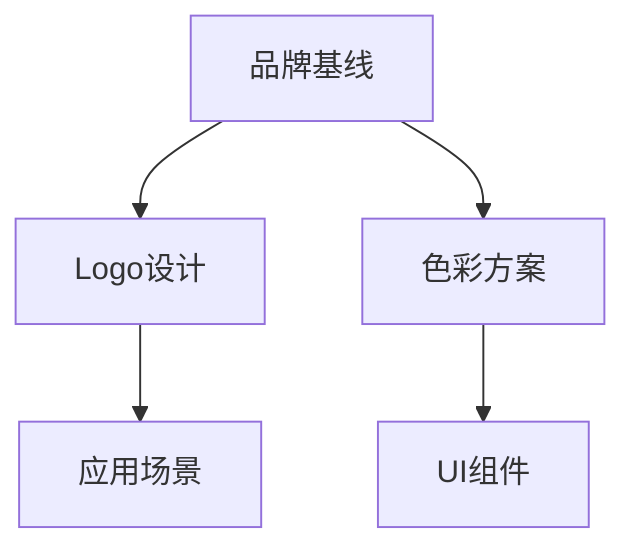

# Bytebot 多角色视觉设计智能体团队设计方案

## 📋 项目概述

本方案为 bytebot.ai 在 Trae IDE 中构建一支专业的"多角色视觉设计智能体团队（Agent Squad）"，采用敏捷开发方式协作，覆盖从品牌策略到视觉产出再到评审质检和落地交付的全流程。

### 🎯 核心目标
- 建立13个专业化Agent角色，形成完整的视觉设计生产线
- 采用双周Sprint敏捷开发模式，确保高效协作
- 输出标准化的视觉资产，包括Logo、图标、UI组件、插画等
- 建立质量保证体系，确保可访问性和品牌一致性
- 提供可直接部署的Trae IDE智能体配置

---

## 🏗️ 团队架构设计

### 核心团队编制（13个Agent角色）

#### 🎯 管理层（2个Agent）

**A0 | 产品负责人 (PO-Brand)**
- **职责**：目标对齐、路线图规划、优先级管理
- **核心任务**：维护视觉Backlog与验收标准、Sprint目标制定
- **输出物**：User Stories、验收标准(DoD)、Sprint目标

**A12 | 发布经理 (Release Manager)**
- **职责**：Sprint里程碑检查、变更记录、发布管理
- **核心任务**：版本发布、回滚策略、里程碑广播
- **输出物**：发布说明、变更日志、版本标签

#### 🎨 策略与总监层（2个Agent）

**A1 | 品牌策略策划 (Brand Strategist)**
- **职责**：品牌调性定义、价值主张、受众画像分析
- **核心任务**：输出品牌基线（色彩/字形/语气）、差异化要素
- **输出物**：品牌基线文档、色彩方案、字体体系

**A2 | 视觉总监 (Design Director)**
- **职责**：需求拆解、视觉原则制定、多端一致性把关
- **核心任务**：Design Tokens制定、关键节点评审
- **输出物**：设计规范、评审报告、风格指南

#### 🎨 生产流水线（5个Agent）

**A3 | Logo生成与演化**
- **职责**：Logo概念设计、符号学分析、多版本输出
- **核心任务**：3-5个方向概念、黑白/反白/单色版本、矢量导出
- **输出物**：Logo概念稿、最终Logo文件、使用规范

**A4 | 图标系统 (Iconography)**
- **职责**：图标网格设计、系统化图标库构建
- **核心任务**：24/32/48网格标准、可变线宽参数设计
- **输出物**：图标库、设计规则、导出文件

**A5 | 插画与营销图 (Illustration)**
- **职责**：场景插画、KV设计、社媒素材制作
- **核心任务**：Hero图设计、多平台裁切、OG图制作
- **输出物**：插画作品、营销素材、社媒模板

**A6 | UI设计 (System UI)**
- **职责**：组件库设计、页面模板制作
- **核心任务**：Atoms→Molecules→Templates设计体系
- **输出物**：组件库、页面模板、Handoff文档

**A7 | 动效与微交互 (Motion)**
- **职责**：品牌动画、组件动效、微交互设计
- **核心任务**：Logo Reveal、按钮动效、Lottie导出
- **输出物**：动效文件、使用说明、性能优化建议

#### 🛡️ 守门人（3个Agent）

**A8 | 可访问性与合规 (A11y QA)**
- **职责**：WCAG合规检查、可访问性评估
- **核心任务**：对比度检查、色盲模拟、动效敏感度测试
- **输出物**：合规报告、修复建议、测试结果

**A10 | 设计质检 (Design QA)**
- **职责**：视觉一致性检查、像素级质量控制
- **核心任务**：色板/网格/间距规范检查、差异报告生成
- **输出物**：质检报告、修复清单、规范对比

**A9 | 资产打包与交付 (Asset Ops)**
- **职责**：资产管理、版本控制、交付打包
- **核心任务**：命名规范、多格式导出、许可证管理
- **输出物**：资产包、版本清单、使用文档

#### 🔧 平台与工程（1个Agent）

**A11 | 提示词工程 (Prompt Engineer)**
- **职责**：Prompt优化、风格Token维护、链路编排
- **核心任务**：可复用Prompt片段库、成本优化、一致性提升
- **输出物**：Prompt库、优化报告、使用指南

---

## ⚡ 敏捷流程设计

### Sprint节奏（双周迭代）

#### 📅 时间安排
- **Sprint周期**：2周（10个工作日）
- **Sprint Planning**：每个Sprint第1天上午（2小时）
- **Daily Standup**：每日上午（10分钟）
- **Mid-Sprint Review**：Sprint第5天下午（1小时）
- **Sprint Review**：Sprint最后一天上午（2小时）
- **Sprint Retrospective**：Sprint最后一天下午（1小时）

#### 🔄 工作流状态
```
Backlog → Ready → In Progress → Design QA → A11y Review → Prompt优化 → PO验收 → Released
```

#### 📋 Sprint工件
1. **产品愿景** - 长期品牌目标和视觉方向
2. **产品路线图** - 季度和月度里程碑
3. **Sprint Backlog** - 当前Sprint任务清单
4. **设计产物** - 各Agent输出的视觉资产
5. **评审报告** - QA和A11y检查结果
6. **发布版本包** - 最终交付的资产包

### 🤝 协作机制

#### Sprint Planning会议
- **参与者**：PO + 视觉总监 + 各专业Agent
- **议程**：
  1. Sprint目标确定（30分钟）
  2. User Story拆解和估点（60分钟）
  3. 任务分配和依赖识别（30分钟）
- **输出**：Sprint Backlog、任务分配表、风险清单

#### Daily Standup
- **时长**：10分钟
- **格式**：每个Agent汇报昨日完成、今日计划、遇到阻塞
- **重点**：依赖协调、资源冲突解决、进度同步

#### 设计评审
- **Mid-Sprint Review**：A2视觉总监主持，重点检查设计方向
- **End-Sprint Review**：A8/A10质检Agent给出最终评估
- **评审标准**：品牌一致性、技术可行性、用户体验、可访问性

---

## 📦 产物清单与交付标准

### 🎨 品牌基线资产

#### 品牌策略文档
- **品牌宣言**：核心价值主张和使命陈述
- **语气指南**：Do/Don't清单，语言风格定义
- **受众画像**：目标用户特征和需求分析
- **差异化要素**：竞争优势和独特卖点

#### 视觉基础系统
- **色彩方案**：主色/辅色/中性色/功能色（含明暗模式）
- **字体体系**：品牌字体、层级定义、使用规范
- **Logo规范**：标准版本、变体、安全区域、错误用法
- **视觉语言**：图形风格、插画风格、摄影风格

### 🎯 Logo系统

#### 设计产出
- **概念稿**：3-5个不同方向的Logo概念
- **最终方案**：选定Logo的完整设计
- **版本变体**：
  - 标准版（彩色）
  - 单色版（黑/白）
  - 反白版（深色背景使用）
  - 简化版（小尺寸使用）
  - 图标版（App Icon/Favicon）

#### 技术规格
- **文件格式**：SVG（矢量）、PNG（栅格）、PDF（印刷）
- **尺寸规格**：@1x/@2x/@3x多倍率
- **网格系统**：对齐网格、安全区域定义
- **使用规范**：最小尺寸、间距要求、禁用场景

### 🔲 图标系统

#### 设计规范
- **网格标准**：24px/32px/48px基础网格
- **设计原则**：线性风格、统一描边、圆角规范
- **变体系统**：线性版/实心版、不同线宽选项
- **命名规范**：功能分类、状态标识、尺寸标记

#### 图标库内容
- **核心功能图标**：24个基础功能（导航、操作、状态等）
- **扩展图标集**：行业特定、产品特色图标
- **状态变体**：默认/悬停/激活/禁用状态
- **导出格式**：SVG源文件、PNG切图、图标字体

### 🎨 UI设计系统

#### Design Tokens
```json
{
  "color": {
    "primary": "#007AFF",
    "secondary": "#5856D6",
    "success": "#34C759",
    "warning": "#FF9500",
    "error": "#FF3B30",
    "neutral": {
      "50": "#F9FAFB",
      "900": "#111827"
    }
  },
  "typography": {
    "fontFamily": {
      "sans": "Inter, system-ui, sans-serif",
      "mono": "JetBrains Mono, monospace"
    },
    "fontSize": {
      "xs": "0.75rem",
      "sm": "0.875rem",
      "base": "1rem",
      "lg": "1.125rem",
      "xl": "1.25rem"
    }
  },
  "spacing": {
    "1": "0.25rem",
    "2": "0.5rem",
    "4": "1rem",
    "8": "2rem"
  }
}
```

#### 组件库
- **原子组件**：Button、Input、Label、Icon、Avatar
- **分子组件**：SearchBox、Navigation、Card、Modal
- **模板组件**：Header、Sidebar、Content、Footer
- **页面模板**：首页、产品页、定价页、登录页

### 🖼️ 插画与营销素材

#### 插画系统
- **风格定义**：扁平化/立体化、色彩运用、构图原则
- **场景插画**：产品功能展示、用户场景、抽象概念
- **图标插画**：功能说明、流程图解、数据可视化
- **装饰元素**：背景纹理、分割线、装饰图案

#### 营销素材
- **网站素材**：Hero图、KV图、Banner、背景图
- **社媒模板**：
  - Twitter/X：1200×675px
  - LinkedIn：1200×627px
  - YouTube：1280×720px
  - Instagram：1080×1080px
- **OG图片**：1200×630px，用于链接分享预览
- **广告素材**：多尺寸广告图、动态Banner

### 🎬 动效系统

#### 动效类型
- **品牌动效**：Logo Reveal、品牌开场动画
- **界面动效**：页面转场、组件动画、加载动画
- **微交互**：按钮反馈、表单验证、状态切换
- **数据动效**：图表动画、进度条、数值变化

#### 技术规格
- **时长控制**：微交互≤200ms，转场≤400ms，品牌动画≤3s
- **缓动函数**：ease-out（入场）、ease-in（出场）、ease-in-out（循环）
- **导出格式**：Lottie JSON、MP4视频、GIF动图
- **性能优化**：低端设备降级、可关闭选项

---

## 📏 统一工作规范

### 🏷️ 命名规范

#### 文件命名
```
bytebot_{domain}_{component}_{state}@{scale}.{ext}
```

**示例：**
- `bytebot_logo_primary@1x.png`
- `bytebot_icon_sync_active@24px.svg`
- `bytebot_ui_button_hover@2x.png`
- `bytebot_illustration_hero_desktop.svg`

#### Token命名
```
bb.{category}.{property}.{variant}
```

**示例：**
- `bb.color.primary.500`
- `bb.font.size.lg`
- `bb.spacing.4`
- `bb.shadow.md`

### 🎨 设计标准

#### 栅格系统
- **基础单位**：4pt/8pt系统
- **页面栅格**：12列栅格，最大宽度1200px
- **安全区域**：移动端16px，桌面端24px
- **断点设置**：
  - Mobile: 320px-768px
  - Tablet: 768px-1024px
  - Desktop: 1024px+

#### 可访问性标准
- **对比度要求**：
  - 正文文本：≥4.5:1
  - 大文本（18pt+）：≥3:1
  - 非文本元素：≥3:1
- **字体大小**：最小12px，推荐14px起
- **触控目标**：最小44×44px
- **动效控制**：
  - 首帧静止可识别
  - 时长≤400ms（非沉浸场景）
  - 提供关闭选项

### 📋 版权与合规

#### 素材来源
- **优先级**：CC0 > 商用授权 > 自创作品
- **记录要求**：来源URL、许可证类型、作者信息
- **审核流程**：A9 Asset Ops Agent负责版权核查
- **白名单库**：预审核的可用素材库

#### 版本管理
- **版本号规则**：语义化版本 vMAJOR.MINOR.PATCH
- **发布快照**：每次发布冻结完整资产清单
- **变更记录**：详细的changelog和release notes
- **回滚机制**：保留前3个版本的完整备份

---

## 📊 度量与KPI体系

### 🎯 交付效率指标

#### Sprint交付
- **完成率**：每Sprint完成的"可发布"卡片数占比
- **漏交率**：未按时完成的任务比例（目标<10%）
- **Lead Time**：从"Ready"到"Released"的平均时长
- **返工率**：因质量问题需要重做的任务比例（目标<5%）

#### 资源利用
- **Agent利用率**：各Agent的工作饱和度
- **阻塞时间**：因依赖等待造成的空闲时间
- **并行度**：同时进行的任务数量
- **资源冲突**：多Agent竞争同一资源的频次

### 🏆 质量保证指标

#### 设计质量
- **A11y通过率**：首次可访问性检查通过比例（目标>95%）
- **Design QA通过率**：首次设计质检通过比例（目标>90%）
- **像素精度**：像素差异<2px的比例（目标>98%）
- **规范一致性**：符合Design Tokens的比例（目标100%）

#### 用户体验
- **5秒测试通过率**：首屏可读性测试合格比例（目标>80%）
- **品牌回忆度**：用户对品牌视觉的记忆和识别度
- **加载性能**：首屏加载时间<2s的比例（目标>95%）
- **多端一致性**：不同平台视觉一致性评分

### 📈 业务影响指标

#### 转化效果
- **CTR提升**：视觉优化后的点击率改善
- **注册转化**：新用户注册率变化
- **品牌认知**：品牌知名度和好感度提升
- **用户留存**：视觉体验对用户留存的影响

#### 成本效益
- **素材复用率**：重复使用现有素材的比例（目标>60%）
- **版权合规率**：100%合规，零版权纠纷
- **制作成本**：单位视觉资产的制作成本
- **维护成本**：设计系统的维护和更新成本

---

## 🚀 实施路线图

### Phase 1: 基础建设（Week 1-2）

#### Sprint 0: 团队组建
- [ ] 13个Agent角色定义和职责分工
- [ ] Trae IDE智能体配置部署
- [ ] 基础工作流和协作规范建立
- [ ] 初始工具和模板准备

#### 关键里程碑
- ✅ 所有Agent角色就位并通过基础测试
- ✅ 第一次Sprint Planning成功举行
- ✅ 基础Design Tokens和命名规范确立

### Phase 2: 品牌建立（Week 3-4）

#### Sprint 1: 品牌基线
- [ ] A1完成品牌策略和基线文档
- [ ] A3产出3-5个Logo概念方案
- [ ] A2制定视觉规范和Design Tokens
- [ ] A8/A10建立质检标准和流程

#### 关键交付物
- 📄 品牌基线文档v1.0
- 🎨 Logo概念稿和最终方案
- 📐 Design Tokens v1.0
- 📋 质检标准和评审流程

### Phase 3: 系统构建（Week 5-8）

#### Sprint 2-3: 设计系统
- [ ] A4完成核心图标系统（24个基础图标）
- [ ] A6构建基础组件库（Button/Input/Card等）
- [ ] A5制作首页KV和核心插画
- [ ] A7设计Logo Reveal和基础动效

#### 关键交付物
- 🔲 图标系统v1.0（24个核心图标）
- 🧩 UI组件库v1.0（8个基础组件）
- 🖼️ 首页视觉资产包
- 🎬 品牌动效库v1.0

### Phase 4: 优化完善（Week 9-12）

#### Sprint 4-5: 质量提升
- [ ] A8完成全面可访问性审计
- [ ] A10建立自动化质检流程
- [ ] A11优化Prompt库和工作流
- [ ] A9完善资产管理和交付流程

#### 关键交付物
- 📊 可访问性审计报告
- 🤖 自动化质检系统
- 📚 Prompt库和最佳实践
- 📦 标准化交付流程

### Phase 5: 规模化运营（Week 13+）

#### 持续改进
- [ ] 基于数据反馈优化设计系统
- [ ] 扩展图标库和组件库
- [ ] 建立设计系统文档站点
- [ ] 培训和推广最佳实践

---

## 🔧 技术实现指南

### Trae IDE集成

#### 智能体配置结构
```yaml
squad_name: "Bytebot Visual Design Squad"
sprint_cadence: "bi-weekly"
version: "1.0.0"

agents:
  - name: "PO-Brand"
    role: "产品负责人"
    model: "claude-3-sonnet"
    system_prompt: |
      你是视觉产品负责人，负责需求澄清、优先级管理和验收标准制定。
      核心原则：品牌一致性、清晰可落地、周期可控。
    tools: ["project_management", "requirement_analysis"]
    outputs: ["user_stories", "acceptance_criteria", "sprint_goals"]
    
  - name: "Brand-Strategist"
    role: "品牌策略"
    model: "claude-3-sonnet"
    system_prompt: |
      你是品牌策略专家，基于行业分析和竞品研究制定品牌基线。
      输出：品牌调性、色彩方案、字体体系、视觉语言。
    tools: ["web_search", "color_analysis", "competitor_analysis"]
    outputs: ["brand_baseline.md", "color_palette.json", "typography.md"]
```

#### 工作流自动化
```yaml
workflows:
  sprint_planning:
    trigger: "schedule:bi-weekly"
    steps:
      - agent: "PO-Brand"
        action: "create_sprint_backlog"
      - agent: "Design-Director"
        action: "review_and_prioritize"
      - agent: "all"
        action: "estimate_and_commit"
        
  design_review:
    trigger: "task_completion"
    steps:
      - agent: "Design-QA"
        action: "quality_check"
      - agent: "A11y-QA"
        action: "accessibility_audit"
      - condition: "all_checks_passed"
        agent: "Asset-Ops"
        action: "prepare_delivery"
```

### 质量保证自动化

#### 设计规范检查
```javascript
// 自动化Design Tokens合规检查
const designTokensValidator = {
  validateColors: (designFile) => {
    const allowedColors = loadDesignTokens().colors;
    const usedColors = extractColors(designFile);
    return usedColors.every(color => 
      allowedColors.includes(color) || 
      isValidColorVariant(color, allowedColors)
    );
  },
  
  validateSpacing: (designFile) => {
    const allowedSpacing = loadDesignTokens().spacing;
    const usedSpacing = extractSpacing(designFile);
    return usedSpacing.every(space => 
      allowedSpacing.includes(space) ||
      isMultipleOfBaseUnit(space, 4)
    );
  }
};
```

#### 可访问性自动检查
```javascript
// 对比度自动检查
const a11yChecker = {
  checkContrast: (foreground, background) => {
    const ratio = calculateContrastRatio(foreground, background);
    return {
      ratio,
      wcagAA: ratio >= 4.5,
      wcagAAA: ratio >= 7,
      recommendation: ratio < 4.5 ? 'increase_contrast' : 'passed'
    };
  },
  
  checkFontSize: (fontSize, fontWeight) => {
    const minSize = fontWeight >= 700 ? 14 : 16;
    return {
      size: fontSize,
      compliant: fontSize >= minSize,
      recommendation: fontSize < minSize ? `increase_to_${minSize}px` : 'passed'
    };
  }
};
```

---

## 📚 模板和工具

### User Story模板

```markdown
## User Story: [功能名称]

**作为** [用户角色]
**我想要** [具体需求]
**以便** [价值/目标]

### 验收标准 (Acceptance Criteria)
- [ ] [具体可测试的标准1]
- [ ] [具体可测试的标准2]
- [ ] [具体可测试的标准3]

### 设计约束
- **平台**: [Web/Mobile/Desktop]
- **尺寸**: [具体尺寸要求]
- **截止时间**: [YYYY-MM-DD]
- **许可证**: [CC0/商用授权/自创]

### Definition of Done
- [ ] 设计符合品牌基线
- [ ] 通过A11y检查（对比度≥4.5:1）
- [ ] 通过Design QA（像素精度<2px）
- [ ] 资产已版本化并归档
- [ ] 包含使用说明和LICENSE
- [ ] PO验收通过

### 估点: [1/2/3/5/8]
### 优先级: [High/Medium/Low]
```

### 设计任务卡模板

```markdown
# 设计任务: [任务名称]

## 📋 基本信息
- **任务ID**: DSG-[YYYY]-[序号]
- **负责Agent**: [Agent名称]
- **Sprint**: [Sprint编号]
- **创建时间**: [YYYY-MM-DD]
- **预计完成**: [YYYY-MM-DD]

## 🎯 任务背景
[详细描述任务背景和上下文]

## 📊 目标与指标
- **主要目标**: [具体目标描述]
- **成功指标**: [可量化的指标，如CTR↑15%]
- **用户价值**: [对用户的具体价值]

## 🔒 约束条件
- **平台限制**: [技术或平台约束]
- **尺寸要求**: [具体尺寸规格]
- **时间限制**: [截止时间和里程碑]
- **预算约束**: [成本或资源限制]
- **合规要求**: [法律或行业规范]

## 📦 交付清单
### 设计文件
- [ ] 源文件 ([Figma/Sketch/AI])
- [ ] 导出文件 ([PNG/SVG/PDF])
- [ ] 多尺寸版本 ([@1x/@2x/@3x])

### 文档资料
- [ ] 设计说明 (README.md)
- [ ] 使用规范 (guidelines.md)
- [ ] 技术规格 (specs.json)

### 质量检查
- [ ] A11y合规检查
- [ ] Design QA验证
- [ ] 品牌一致性审核
- [ ] 性能影响评估

## ✅ 检查清单
### 设计阶段
- [ ] 符合品牌基线和Design Tokens
- [ ] 遵循命名规范
- [ ] 考虑多端适配
- [ ] 包含状态变体（hover/active/disabled）

### 质检阶段
- [ ] A11y QA Agent检查通过
- [ ] Design QA Agent验证通过
- [ ] 像素精度检查（差异<2px）
- [ ] 对比度检查（≥4.5:1）

### 交付阶段
- [ ] Asset Ops Agent打包完成
- [ ] 版本号标记正确
- [ ] LICENSE文件包含
- [ ] 使用说明完整

## 📁 归档信息
- **文件路径**: [具体存储路径]
- **版本号**: [v1.0.0]
- **变更说明**: [本次变更的详细说明]
- **相关任务**: [关联的其他任务ID]
```

### Sprint Planning模板

```markdown
# Sprint Planning - Sprint [编号]

## 📅 基本信息
- **Sprint编号**: Sprint-[YYYY]-[序号]
- **计划日期**: [YYYY-MM-DD]
- **Sprint周期**: [开始日期] - [结束日期]
- **参与人员**: [PO + 视觉总监 + 各Agent]

## 🎯 Sprint目标
### 主要目标
[本Sprint要达成的核心目标，1-3个]

### 成功标准
- [ ] [可量化的成功标准1]
- [ ] [可量化的成功标准2]
- [ ] [可量化的成功标准3]

## 📋 Backlog Items

| ID | User Story | Agent | 估点 | 优先级 | 依赖 |
|----|------------|-------|------|--------|------|
| US-001 | [Story描述] | A1 | 3 | High | - |
| US-002 | [Story描述] | A3 | 5 | High | US-001 |
| US-003 | [Story描述] | A4 | 2 | Medium | - |

## 🔄 依赖关系


## ⚠️ 风险识别
| 风险 | 影响 | 概率 | 缓解措施 | 负责人 |
|------|------|------|----------|--------|
| [风险描述] | High/Medium/Low | High/Medium/Low | [具体措施] | [Agent] |

## 📊 容量规划
| Agent | 可用工时 | 已分配 | 利用率 |
|-------|----------|--------|--------|
| A1 | 40h | 24h | 60% |
| A2 | 40h | 32h | 80% |
| A3 | 40h | 40h | 100% |

## 🎯 Definition of Done
- [ ] 所有User Story完成并通过验收
- [ ] A11y和Design QA检查100%通过
- [ ] 资产已版本化并归档
- [ ] Sprint Review成功举行
- [ ] Retrospective完成并记录改进项
```

---

## 🎉 总结

这个多角色视觉设计智能体团队方案为bytebot.ai提供了一个完整、可执行的视觉设计生产体系。通过13个专业化Agent的协作，采用敏捷开发模式，能够高效产出高质量的视觉资产，确保品牌一致性和用户体验。

### 🔑 核心优势
1. **专业分工**：每个Agent专注特定领域，提高专业度和效率
2. **质量保证**：多层质检机制，确保输出质量和合规性
3. **敏捷协作**：双周Sprint节奏，快速迭代和反馈
4. **标准化**：统一的规范和模板，确保一致性
5. **可扩展**：模块化设计，便于后续扩展和优化

### 🚀 下一步行动
1. 部署Trae IDE智能体配置
2. 组建第一个Sprint团队
3. 执行Phase 1基础建设
4. 建立度量和反馈机制
5. 持续优化和改进流程

通过这个系统化的方案，bytebot.ai将拥有一支高效、专业的视觉设计智能体团队，为产品的视觉体验和品牌建设提供强有力的支撑。