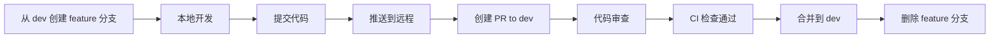
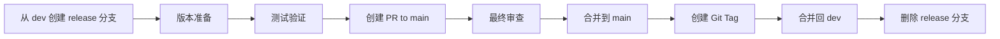

# ByteBot 开发流程与分支策略
*Cursor IDE Agent 团队工程规范文档*

## 🌳 分支策略

### 分支模型
采用 **Git Flow** 简化版本，包含以下分支类型：

```
main (受保护)
├── dev (开发主分支)
│   ├── feature/feat-name (功能分支)
│   ├── bugfix/fix-name (修复分支)
│   └── chore/task-name (工程任务分支)
├── release/v1.0.0 (发布分支)
└── hotfix/urgent-fix (紧急修复分支)
```

### 分支保护规则

#### main 分支 (生产分支)
- ✅ **受保护**: 禁止直接推送
- ✅ **PR 必需**: 所有变更必须通过 PR
- ✅ **审查必需**: 至少 1 名 reviewer 批准
- ✅ **状态检查**: 所有 CI 检查必须通过
- ✅ **分支更新**: PR 合并前必须与 main 同步
- ✅ **管理员强制**: 管理员也需遵循规则

#### dev 分支 (开发分支)
- ✅ **受保护**: 禁止直接推送
- ✅ **PR 必需**: 功能开发通过 PR 合并
- ✅ **状态检查**: CI 检查必须通过
- ⚠️ **审查可选**: 小型修改可跳过审查

## 📝 分支命名规范

### 命名格式
```bash
<type>/<scope>-<description>

# 示例
feature/auth-login          # 功能: 登录认证
feature/ui-chat-interface   # 功能: 聊天界面
bugfix/memory-leak-fix      # 修复: 内存泄漏
chore/ci-setup             # 工程: CI 配置
hotfix/security-patch      # 热修复: 安全补丁
```

### 分支类型
- **feature/**: 新功能开发
- **bugfix/**: 问题修复
- **chore/**: 工程任务 (CI/CD, 依赖更新, 重构)
- **hotfix/**: 紧急修复 (直接从 main 分出)
- **release/**: 发布准备 (版本号命名)

### 命名约定
- 使用 kebab-case (小写 + 连字符)
- 描述简洁明确，不超过 30 字符
- 避免使用 issue 编号作为主要描述

## 🔄 开发工作流程

### 1. 功能开发流程


### 2. 发布流程


### 3. 热修复流程


## 📋 提交流程规范

### 提交前检查清单
- [ ] 代码符合 ESLint/Prettier 规范
- [ ] TypeScript 类型检查通过
- [ ] Rust 代码通过 rustfmt + clippy
- [ ] 单元测试通过
- [ ] 提交信息符合 Conventional Commits
- [ ] 相关文档已更新

### PR 创建规范
1. **标题格式**: 遵循 Conventional Commits
   ```
   feat(scope): add user authentication
   fix(api): resolve memory leak in chat service
   chore(ci): update GitHub Actions workflow
   ```

2. **描述模板**: 使用 PR 模板填写
   - 变更说明
   - 测试验证
   - 破坏性变更
   - 相关 Issue

3. **标签使用**:
   - `type: feature` - 新功能
   - `type: bugfix` - 问题修复
   - `type: chore` - 工程任务
   - `priority: high/medium/low` - 优先级
   - `size: S/M/L/XL` - 变更规模

## 🏷️ 版本号策略 (SemVer)

### 版本格式
```
MAJOR.MINOR.PATCH[-PRERELEASE][+BUILD]

示例:
1.0.0          # 正式版本
1.1.0-beta.1   # Beta 预发布版本
1.0.1-alpha.2  # Alpha 预发布版本
2.0.0-rc.1     # Release Candidate
```

### 版本递增规则
- **MAJOR (主版本)**: 不兼容的 API 变更
- **MINOR (次版本)**: 向后兼容的功能新增
- **PATCH (修订版本)**: 向后兼容的问题修复

### 预发布版本
- **alpha**: 内部测试版本，功能不完整
- **beta**: 公开测试版本，功能基本完整
- **rc**: 发布候选版本，准备正式发布

### 版本发布节奏
```yaml
开发周期:
  - Sprint: 2周
  - Minor Release: 4周 (每2个Sprint)
  - Major Release: 12周 (每6个Sprint)

发布时间:
  - Alpha: 每周五 (内部)
  - Beta: 每2周 (公开测试)
  - RC: 发布前1周
  - Release: 按计划发布
```

## 🔍 代码审查规范

### 审查要求
- **必须审查**: main 分支的所有 PR
- **建议审查**: dev 分支的功能 PR
- **快速审查**: 紧急修复和小型变更

### 审查清单
#### 功能性
- [ ] 功能实现符合需求
- [ ] 边界条件处理完整
- [ ] 错误处理机制合理
- [ ] 性能影响可接受

#### 代码质量
- [ ] 代码结构清晰
- [ ] 命名规范一致
- [ ] 注释充分且准确
- [ ] 无明显代码异味

#### 安全性
- [ ] 输入验证完整
- [ ] 敏感信息处理安全
- [ ] 权限控制正确
- [ ] 依赖安全无漏洞

#### 测试覆盖
- [ ] 单元测试充分
- [ ] 集成测试覆盖关键路径
- [ ] 测试用例有意义
- [ ] 覆盖率达到要求

### 审查反馈规范
- **必须修复 (Must Fix)**: 阻塞合并的问题
- **建议改进 (Should Fix)**: 建议修复的问题
- **可选优化 (Could Fix)**: 可选的优化建议
- **学习讨论 (Discussion)**: 技术讨论和学习

## 🚀 发布管理

### 发布准备
1. **版本规划**: 确定版本号和发布内容
2. **功能冻结**: 停止新功能开发
3. **测试验证**: 完整的测试验证
4. **文档更新**: 更新用户文档和 CHANGELOG
5. **发布审批**: 团队 lead 审批发布

### 发布执行
1. **创建 release 分支**: `release/v1.0.0`
2. **最终测试**: 在 release 分支进行最终测试
3. **合并到 main**: 通过 PR 合并
4. **创建 Git Tag**: 标记发布版本
5. **构建发布**: 自动构建和发布
6. **发布通知**: 通知相关人员

### 发布后处理
1. **合并回 dev**: 将 release 分支合并回 dev
2. **删除分支**: 清理 release 分支
3. **监控观察**: 监控发布后的系统状态
4. **问题响应**: 快速响应发布后问题

## 📊 流程监控指标

### 开发效率指标
- **PR 平均处理时间**: < 24小时
- **代码审查响应时间**: < 4小时
- **CI 执行时间**: < 10分钟
- **发布频率**: 每2周一次 minor 版本

### 质量指标
- **PR 通过率**: > 95%
- **回滚率**: < 5%
- **热修复频率**: < 1次/月
- **代码覆盖率**: > 80%

### 团队协作指标
- **代码审查参与度**: 每人每周 > 3次
- **知识分享**: 每月技术分享 > 2次
- **文档更新及时性**: 与代码同步更新

## 🛠️ 工具和自动化

### Git Hooks
- **pre-commit**: 代码格式化和基础检查
- **commit-msg**: 提交信息格式验证
- **pre-push**: 推送前测试验证

### GitHub 集成
- **Actions**: 自动化 CI/CD
- **Branch Protection**: 分支保护规则
- **Issue Templates**: 标准化问题报告
- **PR Templates**: 标准化 PR 描述

### 开发工具
- **VS Code**: 统一开发环境配置
- **ESLint/Prettier**: 代码格式化
- **Husky**: Git hooks 管理
- **Commitizen**: 交互式提交信息生成

## 🔄 流程持续改进

### 定期评审
- **每月**: 流程效率评审
- **每季度**: 工具和规范更新
- **每半年**: 分支策略优化
- **每年**: 整体流程重构

### 反馈机制
- **团队回顾**: Sprint 回顾会议
- **流程建议**: 随时提出改进建议
- **工具评估**: 定期评估开发工具效果
- **最佳实践**: 总结和分享最佳实践

---

> **文档版本**: v1.0  
> **最后更新**: 2025年9月25日  
> **负责团队**: Cursor IDE Agent 团队  
> **下次评审**: 2025年12月25日
