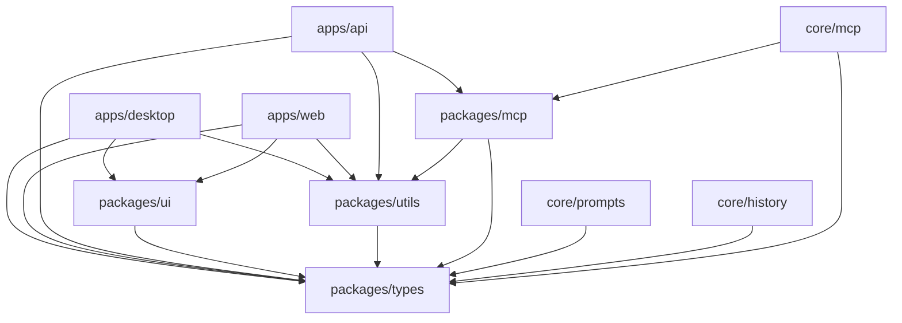

# ByteBot Monorepo 架构指南
*Cursor IDE Agent 团队工程架构文档*

## 🏗️ Monorepo 架构概述

ByteBot 采用 monorepo 架构，使用 npm workspaces 管理多个相关包，实现代码共享、统一构建和版本管理。

## 📁 目录结构

### 推荐结构
```
bytebot-ecosystem/
├── apps/                          # 应用程序
│   ├── desktop/                   # Tauri 桌面应用
│   │   ├── src-tauri/            # Rust 后端
│   │   ├── src/                  # React 前端
│   │   ├── package.json
│   │   └── tauri.conf.json
│   ├── web/                      # Next.js Web 应用
│   │   ├── src/
│   │   ├── pages/
│   │   ├── package.json
│   │   └── next.config.js
│   └── api/                      # NestJS API 服务
│       ├── src/
│       ├── package.json
│       └── nest-cli.json
├── packages/                     # 共享包
│   ├── ui/                       # 共享 UI 组件
│   │   ├── src/
│   │   ├── package.json
│   │   └── tailwind.config.js
│   ├── types/                    # 共享类型定义
│   │   ├── src/
│   │   └── package.json
│   ├── config/                   # 共享配置
│   │   ├── eslint/
│   │   ├── typescript/
│   │   ├── jest/
│   │   └── package.json
│   ├── utils/                    # 共享工具函数
│   │   ├── src/
│   │   └── package.json
│   └── mcp/                      # MCP 协议实现
│       ├── src/
│       └── package.json
├── core/                         # 核心功能模块 (现有)
│   ├── prompts/
│   ├── history/
│   └── mcp/
├── config/                       # 项目配置 (现有)
├── docs/                         # 文档
├── scripts/                      # 构建和部署脚本
├── .github/                      # GitHub 配置
├── docker/                       # Docker 配置
├── package.json                  # 根 package.json
├── tsconfig.json                 # 根 TypeScript 配置
├── .eslintrc.js                  # 根 ESLint 配置
└── .prettierrc.js               # 根 Prettier 配置
```

### 当前结构分析
```
bytebot-ecosystem/ (当前)
├── packages/                     # ✅ 已存在
│   ├── bytebot-ui/              # Web UI
│   ├── bytebot-agent/           # AI 智能体服务
│   ├── bytebotd/                # 桌面服务守护进程
│   ├── bytebot-llm-proxy/       # LiteLLM 代理
│   └── shared/                  # 共享工具库
├── core/                        # ✅ 已存在 - 核心功能模块
├── config/                      # ✅ 已存在 - 统一配置
├── docs/                        # ✅ 已存在 - 项目文档
└── docker/                      # ✅ 已存在 - 容器配置
```

## 📦 包管理策略

### Workspace 配置
```json
{
  "name": "bytebot-ecosystem",
  "private": true,
  "workspaces": [
    "packages/*",
    "core/*",
    "apps/*"
  ],
  "packageManager": "npm@10.0.0"
}
```

### 依赖管理原则
1. **共享依赖**: 在根目录管理公共依赖
2. **特定依赖**: 在各包中管理特定依赖
3. **版本统一**: 使用相同版本的核心依赖
4. **依赖提升**: 利用 npm workspaces 的依赖提升

### 包版本策略
```json
{
  "dependencies": {
    "@bytebot/ui": "workspace:*",
    "@bytebot/types": "workspace:*",
    "@bytebot/utils": "workspace:*"
  }
}
```

## 🎯 包职责边界

### Apps 层 (应用程序)
#### apps/desktop (Tauri 桌面应用)
- **职责**: 原生桌面应用，系统集成
- **技术栈**: Tauri + Rust + React
- **依赖**: @bytebot/ui, @bytebot/types
- **输出**: 桌面应用安装包

#### apps/web (Next.js Web 应用)
- **职责**: Web 用户界面
- **技术栈**: Next.js + React + TypeScript
- **依赖**: @bytebot/ui, @bytebot/types
- **输出**: 静态网站或 SSR 应用

#### apps/api (NestJS API 服务)
- **职责**: 后端 API 服务
- **技术栈**: NestJS + TypeScript + Prisma
- **依赖**: @bytebot/types, @bytebot/utils
- **输出**: API 服务

### Packages 层 (共享包)
#### packages/ui (UI 组件库)
- **职责**: 可复用的 UI 组件
- **技术栈**: React + TypeScript + Tailwind CSS
- **依赖**: @bytebot/types
- **输出**: 组件库

```typescript
// 示例导出
export { Button } from './Button';
export { Input } from './Input';
export { Modal } from './Modal';
export type { ButtonProps, InputProps } from './types';
```

#### packages/types (类型定义)
- **职责**: 共享的 TypeScript 类型定义
- **技术栈**: TypeScript
- **依赖**: 无
- **输出**: 类型定义

```typescript
// 示例类型定义
export interface User {
  id: string;
  name: string;
  email: string;
}

export interface ApiResponse<T> {
  data: T;
  message: string;
  success: boolean;
}
```

#### packages/config (配置包)
- **职责**: 共享的配置文件
- **技术栈**: JavaScript/JSON
- **依赖**: 相关工具包
- **输出**: 配置文件

```javascript
// packages/config/eslint/index.js
module.exports = {
  extends: ['@bytebot/eslint-config'],
  // 共享 ESLint 配置
};
```

#### packages/utils (工具函数)
- **职责**: 共享的工具函数和常量
- **技术栈**: TypeScript
- **依赖**: @bytebot/types
- **输出**: 工具函数库

```typescript
// 示例工具函数
export const formatDate = (date: Date): string => {
  return date.toISOString().split('T')[0];
};

export const debounce = <T extends (...args: any[]) => any>(
  func: T,
  wait: number
): T => {
  // 防抖实现
};
```

#### packages/mcp (MCP 协议)
- **职责**: MCP 协议实现和客户端
- **技术栈**: TypeScript
- **依赖**: @bytebot/types, @bytebot/utils
- **输出**: MCP 客户端库

### Core 层 (核心模块) - 现有
- **core/prompts**: 提示词管理
- **core/history**: 对话历史管理
- **core/mcp**: MCP 协议支持

## 🔗 依赖关系图



## 🛠️ 构建和开发流程

### 开发命令
```bash
# 安装所有依赖
npm install

# 开发模式 (所有应用)
npm run dev

# 构建所有包
npm run build

# 测试所有包
npm run test

# 特定包操作
npm run dev --workspace=apps/desktop
npm run build --workspace=packages/ui
npm run test --workspace=apps/api
```

### 构建顺序
1. **packages/types** - 类型定义 (无依赖)
2. **packages/utils** - 工具函数 (依赖 types)
3. **packages/config** - 配置文件 (无依赖)
4. **packages/ui** - UI 组件 (依赖 types)
5. **packages/mcp** - MCP 协议 (依赖 types, utils)
6. **apps/api** - API 服务 (依赖 types, utils, mcp)
7. **apps/web** - Web 应用 (依赖 ui, types, utils)
8. **apps/desktop** - 桌面应用 (依赖 ui, types, utils)

### 发布流程
```bash
# 版本管理
npm version patch --workspaces

# 构建所有包
npm run build

# 发布 (如果是公开包)
npm publish --workspaces
```

## 📋 最佳实践

### 包设计原则
1. **单一职责**: 每个包有明确的职责
2. **最小依赖**: 减少不必要的依赖
3. **向上依赖**: 低层包不依赖高层包
4. **接口稳定**: 公共 API 保持稳定

### 代码组织
```typescript
// packages/ui/src/index.ts
export { Button } from './components/Button';
export { Input } from './components/Input';
export type { ButtonProps, InputProps } from './types';

// 避免导出内部实现
// export { ButtonInternal } from './internal/Button'; // ❌
```

### 版本管理
- **主版本**: 不兼容的 API 变更
- **次版本**: 向后兼容的功能新增
- **修订版本**: 向后兼容的问题修复
- **工作区版本**: 使用 `workspace:*` 引用

### 测试策略
```bash
# 单元测试 (各包独立)
npm run test:unit --workspace=packages/ui

# 集成测试 (跨包测试)
npm run test:integration

# E2E 测试 (应用层测试)
npm run test:e2e --workspace=apps/desktop
```

## 🔄 迁移计划

### 当前结构优化
由于项目已有良好的结构，建议渐进式优化：

#### 阶段 1: 配置统一 (当前)
- ✅ 统一 ESLint/Prettier 配置
- ✅ 统一 TypeScript 配置
- ✅ 统一测试配置

#### 阶段 2: 类型提取 (下个 Sprint)
- 创建 `packages/types` 包
- 提取共享类型定义
- 更新各包依赖

#### 阶段 3: 工具函数提取 (后续)
- 创建 `packages/utils` 包
- 提取共享工具函数
- 优化依赖关系

#### 阶段 4: UI 组件提取 (后续)
- 创建 `packages/ui` 包
- 提取可复用组件
- 建立设计系统

### 迁移检查清单
- [ ] 包结构规划完成
- [ ] 依赖关系梳理清楚
- [ ] 构建流程验证通过
- [ ] 测试覆盖率保持
- [ ] 文档更新完成
- [ ] 团队培训完成

## 📊 监控指标

### 包健康度
- **依赖数量**: 控制在合理范围
- **包大小**: 监控包体积增长
- **构建时间**: 优化构建性能
- **测试覆盖率**: 保持高覆盖率

### 开发效率
- **构建速度**: 全量构建 < 5分钟
- **热重载**: 开发模式响应 < 2秒
- **依赖安装**: 首次安装 < 3分钟
- **测试执行**: 单元测试 < 30秒

---

> **文档版本**: v1.0  
> **最后更新**: 2025年9月25日  
> **负责团队**: Cursor IDE Agent 团队  
> **下次评审**: 2025年12月25日
